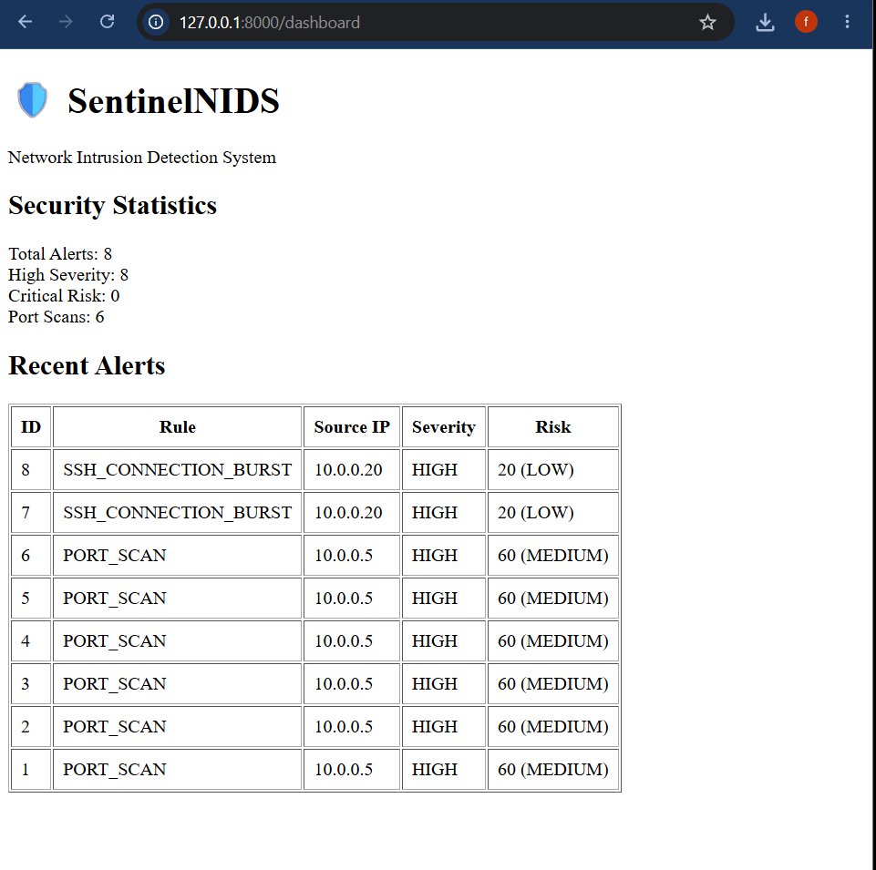
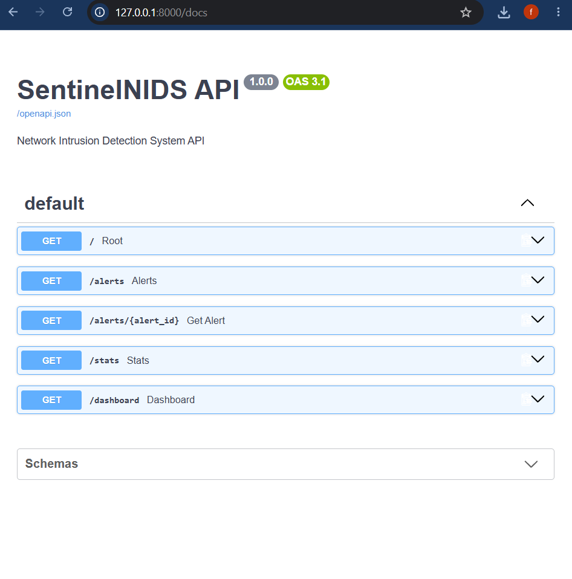

# SentinelNIDS

A Python-based Network Intrusion Detection System (NIDS) that analyzes network packets, detects suspicious activity, calculates risk, stores alerts in SQLite, and exposes security data through a FastAPI backend.

## Features

* Live packet capture using Scapy
* TCP/IP packet parsing
* Port scan detection
* SSH burst detection
* Risk scoring
* SQLite alert storage
* FastAPI REST API
* Security statistics endpoint
* Web dashboard
* Automated tests with pytest

## Architecture

```text
Network / PCAP
      ↓
Packet Parser
      ↓
Detection Engine
      ↓
Suspicious Activity
      ↓
Risk Score
      ↓
Security Alert
      ↓
SQLite + FastAPI
      ↓
Dashboard
```

## API Endpoints

| Endpoint       | Purpose              |
| -------------- | -------------------- |
| `/`            | API status           |
| `/alerts`      | List security alerts |
| `/alerts/{id}` | Get a specific alert |
| `/stats`       | Security statistics  |
| `/dashboard`   | Web dashboard        |

## Dashboard



## API Documentation

Interactive FastAPI Swagger documentation:




## Testing

Run the automated test suite:

```bash
python -m pytest -q
```

Current test status: **9 passed**

## Tech Stack

* Python
* Scapy
* FastAPI
* SQLite
* Pytest
* HTML
* JavaScript

## Project Structure

```text
SentinelNIDS/
│
├── app/
│   ├── core/
│   │   ├── capture.py
│   │   ├── engine.py
│   │   ├── packet_parser.py
│   │   └── risk.py
│   │
│   ├── detectors/
│   │   └── rules.py
│   │
│   ├── storage/
│   │   └── database.py
│   │
│   └── api.py
│
├── tests/
│   └── test_parser.py
│
├── templates/
│   └── dashboard.html
│
├── main.py
├── dashboard.png
├── .gitignore
└── README.md
```

## Running the Project

Create and activate the virtual environment:

```powershell
python -m venv .venv
.\.venv\Scripts\Activate.ps1
```

Install dependencies:

```powershell
python -m pip install scapy pytest fastapi uvicorn jinja2
```

Run tests:

```powershell
python -m pytest -q
```

Start SentinelNIDS:

```powershell
python main.py
```

Start the API:

```powershell
python -m uvicorn app.api:app --reload
```

Open the dashboard:

```text
http://127.0.0.1:8000/dashboard
```

Open the API documentation:

```text
http://127.0.0.1:8000/docs
```

## Security Detection

SentinelNIDS currently detects suspicious network behavior including:

* Multiple destination ports contacted by a single source IP
* Rapid SSH connection bursts

Detected activity is converted into security alerts with:

* Detection rule
* Source IP
* Severity
* Risk score
* Risk level
* Description

## Example Alert

```text
Rule: PORT_SCAN
Source IP: 10.0.0.5
Ports Contacted: 5
Severity: HIGH
Risk Score: 60
Risk Level: MEDIUM
```

## Disclaimer

This project is intended for educational, defensive security monitoring, and authorized network testing only.
